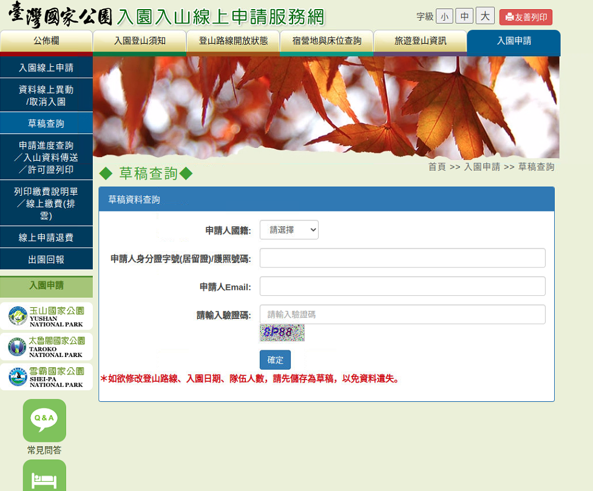

# Automatic_online_registration

A registration program have auto-login, auto-submit in self-setting time in [Online-Application-Service-Network](https://npm.cpami.gov.tw/apply_2_1.aspx) for National Park Admission and Mountain Entry in Taiwan

# Getting Started

### Pre-requirements
* Environment
  - Python **3.8.10**

* Python package
  ```Shell
  pip install -r ./env/requirements.txt
  ```
* Pre-setting
  ```
  You must be setting draft and fill any data in all table.
  ```
### Demo
```
python3 auto_demo.py -e email@gmail.com -i A123456789 -hour 7 -min 0
```
- -e: The email of login draft 
- -i: The ID number f login draft 
- -hour: Required hour of login 
- -min: Required minute of login 

<div align="center">
  
</div>